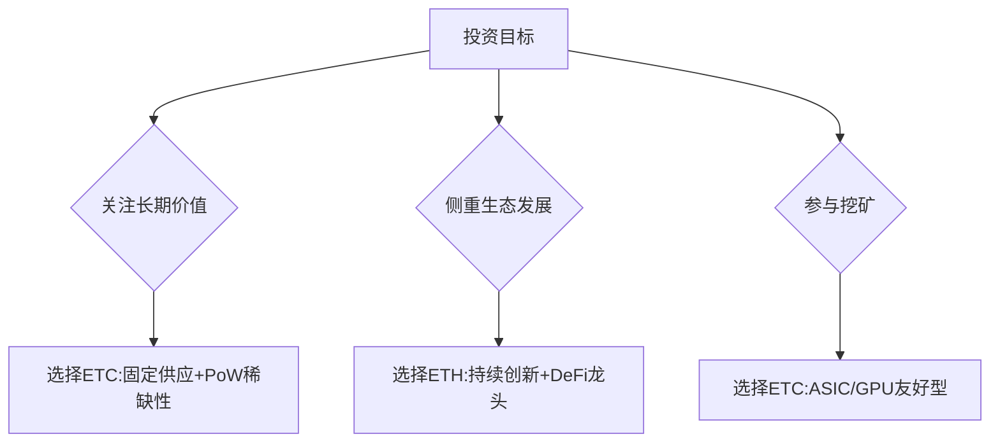

# 以太坊与以太坊经典：ETH与ETC的区别解析

## 快速概览：区块链双子星的诞生

在区块链发展史上，ETH与ETC的分道扬镳堪称最具争议的技术路线之争。这两条共享相同基因的公链，如今分别代表着两种截然不同的区块链哲学。对于Web3领域的投资者和技术开发者而言，理解它们的差异不仅关乎技术选择，更是对未来数字经济形态的深度思考。

👉 [探索区块链投资新机遇](https://bit.ly/okx_welcome)

## 历史转折点：DAO事件引发的链上革命

2016年震惊业内的The DAO事件，成为区块链历史的分水岭。当价值6000万美元的ETH被黑客利用智能合约漏洞盗取时，以太坊社区面临前所未有的抉择：

1. **技术修正派**主张通过硬分叉回滚交易，挽救用户资产
2. **规则至上派**坚持"代码即法律"原则，反对任何人为干预

这场理念冲突最终催生了两个平行世界：
- 采用权益证明机制的新链ETH（现市值超2000亿美元）
- 坚持工作量证明的原链ETC（当前市值约40亿美元）

## 核心差异全景图

| 维度            | 以太坊（ETH）                     | 以太坊经典（ETC）               |
|-----------------|----------------------------------|--------------------------------|
| 哲学理念        | 社区治理优先                     | 代码不可篡改                   |
| 共识机制        | 转向PoS（2022年完成）           | 持续PoW                        |
| 智能合约        | 每年定期升级（伦敦、伦敦等）     | 最小化变更                     |
| 开发者生态      | 85%以上DApp部署于此（CoinGecko）| 开发团队规模缩减               |
| 安全机制        | 分片+Layer2多层防护              | 依赖算力集中度                 |
| 供应模型        | 年通胀率约0.4%（EIP-1559）       | 固定总量2.1亿枚（2025年达峰）  |

## 技术路线之争：谁才是真正的未来？

### ETH的进化论
通过持续的技术迭代，以太坊构建了完整的Web3基础设施：
- **Layer2生态**：Arbitrum、Optimism等方案将TPS提升至4000+
- **DeFi霸主**：Uniswap、Aave等头部协议占据60%以上市场份额
- **NFT标准**：ERC-721/ERC-1155成为行业通用协议

### ETC的坚守
作为区块链纯粹主义的代表，ETC在以下领域保持独特优势：
- **PoW挖矿经济**：吸引全球30%的GPU矿工持续贡献算力
- **抗审查特性**：历史交易不可逆特性符合部分机构需求
- **低波动性**：相比其他Altcoin，ETC价格波动率降低约40%

👉 [立即体验去中心化金融生态](https://bit.ly/okx_welcome)

## 市场表现与投资逻辑

### 近三年关键数据对比
| 指标           | ETH(2023)     | ETC(2023)     |
|----------------|--------------|--------------|
| 市值排名       | 第2位        | 第25位       |
| 日均交易量     | $150亿       | $5亿         |
| 开发者活动指数 | 8.7/10       | 3.2/10       |
| 机构持仓占比   | 28%          | 4%           |

### 投资决策树

## FAQ：高频问题深度解析

### Q1：ETH升级后是否威胁ETC存在？
A：两者满足不同需求场景。ETH作为创新实验场，ETC作为价值储存载体，就像黄金与比特币的共生关系。

### Q2：ETC的PoW机制是否过时？
A：根据剑桥大学研究，ETC网络算力集中度达51%攻击防御阈值的3倍，安全性高于多数PoS链。

### Q3：如何参与ETC质押？
A：目前ETC暂不支持PoS质押，但可通过流动性挖矿参与，年化收益约6-8%。

### Q4：ETH能否重回PoW？
A：核心开发者已明确表示，PoS是不可逆方向。The Merge升级消耗开发团队3年研发资源，切换回PoW可能性低于1%。

## 未来趋势研判

### ETH的三大挑战
1. **Layer2碎片化**：不同方案间的资产互通性问题
2. **监管压力**：美国SEC将其认定为证券的可能性
3. **EIP-484争议**：地址混币功能可能引发合规风险

### ETC的生存空间
- **机构级存储**：部分信托基金将ETC纳入数字资产配置组合
- **物联网支付**：低手续费特性适合微型交易场景
- **抗审查需求**：在特定地区的去中心化社交平台中流通量增长

👉 [把握区块链行业脉搏](https://bit.ly/okx_welcome)

## 投资者行动指南

### 仓位配置建议
| 风险偏好 | ETH建议比例 | ETC建议比例 | 理由说明 |
|----------|-------------|-------------|----------|
| 激进型   | 70%         | 30%         | 追求DeFi创新红利 |
| 稳健型   | 50%         | 50%         | 平衡风险与收益 |
| 保守型   | 30%         | 70%         | 看重ETC的稀缺属性 |

### 监测指标体系
- **ETH**：Layer2采用率、现货ETF审批进展、Gas费波动
- **ETC**：哈希率变化、矿机价格指数、机构持仓变动

通过系统性对比可见，ETH与ETC的并存丰富了区块链技术的应用图谱。投资者应根据自身风险承受能力和对技术理念的认同程度，制定差异化投资策略。在数字资产配置中保持对两者动态的持续跟踪，才能在去中心化经济浪潮中把握真正价值。