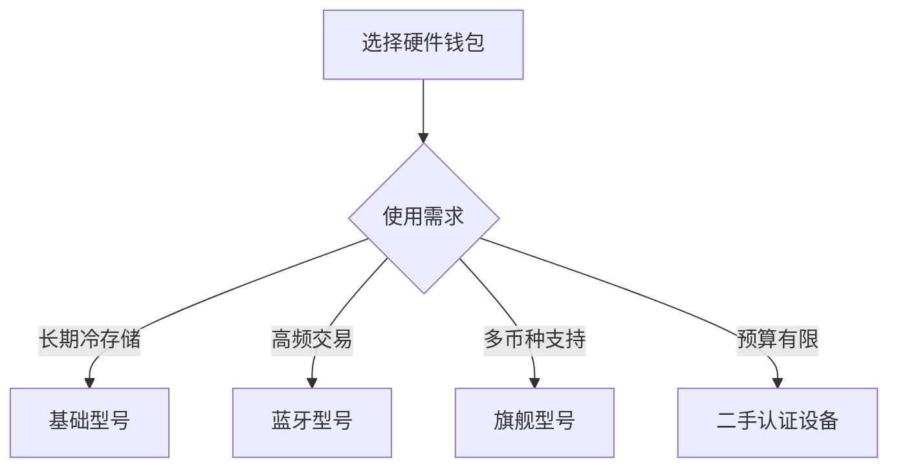

# 2025年最佳比特币与加密货币硬件钱包推荐

随着比特币和加密货币逐渐融入日常生活，数字资产安全存储成为用户首要关注的问题。硬件钱包作为当前最可靠的存储方案，正受到越来越多投资者的青睐。本文将深入解析硬件钱包的工作原理、核心优势，并提供主流产品的对比分析。

## 什么是硬件钱包？

硬件钱包是一种专为存储加密货币私钥设计的物理设备，其核心功能包括：
- 离线存储私钥（冷存储）
- 交易签名验证
- 与计算机/手机的安全连接

与软件钱包不同，硬件钱包通过物理隔离确保私钥永不接触联网设备。即使连接到被恶意软件感染的电脑，也能保证数字资产安全。这种技术特性使其成为抵御网络攻击的终极解决方案。

### 工作原理详解

1. **私钥生成**：首次使用时通过随机数生成器创建私钥
2. **交易签名**：在设备内部完成签名流程，无需暴露私钥
3. **安全验证**：通过物理按钮确认交易细节，防止恶意篡改

> ⚠️ 安全提示：设备配套的12/24位助记词是恢复资产的关键，建议采用金属备份方案并分开存放

## 为什么需要硬件钱包？

### 安全性对比（2024年数据）

| 存储方式       | 安全指数 | 风险等级 | 适用场景          |
|----------------|----------|----------|-------------------|
| 硬件钱包       | ⭐⭐⭐⭐⭐   | 极低     | 长期持有/大额资产 |
| 交易所账户     | ⭐⭐       | 高       | 短期交易          |
| 手机钱包       | ⭐⭐⭐      | 中       | 日常小额支付      |
| 纸钱包         | ⭐⭐⭐⭐     | 中       | 极冷存储          |

👉 [对比主流硬件钱包性能参数](https://bit.ly/okx_welcome)

## 2025年推荐硬件钱包

### 1. Ledger Nano X
- **核心优势**：蓝牙连接+手机App管理
- **支持币种**：超过5500种加密货币
- **安全认证**：CC EAL5+芯片防护
- **价格**：119欧元

### 2. Trezor Model T
- **特色功能**：彩色触控屏+开源代码
- **兼容性**：支持第三方钱包软件（Electrum等）
- **更新机制**：强制固件验证更新
- **价格**：149欧元

### 3. Bitlox Advanced
- **便携设计**：信用卡尺寸（86×54mm）
- **续航能力**：30天超长待机
- **专注领域**：比特币专项存储
- **价格**：99欧元

## 如何选择硬件钱包？

### 选购决策树

👉 [获取硬件钱包选购指南PDF](https://bit.ly/okx_welcome)

### 常见问题解答（FAQ）

**Q：硬件钱包丢失怎么办？**  
A：通过助记词可在新设备恢复资产，建议创建3份物理备份分别存放。

**Q：是否需要定期更新固件？**  
A：建议每季度检查更新，旗舰型号支持自动验证更新机制。

**Q：如何验证设备真伪？**  
A：通过官网序列号验证+首次使用时的代码校验，避免购买二手/翻新设备。

**Q：支持哪些操作系统？**  
A：主流型号兼容Windows/Mac/Linux及iOS/Android系统。

## 使用技巧与注意事项

### 安全实践清单

1. **物理防护**：避免设备接触液体和高温环境
2. **交易确认**：始终通过设备屏幕核对交易详情
3. **备份管理**：采用金属备份方案（如Cryptosteel）
4. **软件更新**：仅通过官方渠道升级固件
5. **网络隔离**：重要资产建议采用双钱包存储策略

### 典型使用场景

| 用户类型     | 存储方案                  | 推荐型号        |
|--------------|---------------------------|-----------------|
| 长期投资者   | 主钱包+多签冷存储         | Ledger Nano X   |
| 日常交易者   | 硬件钱包+手机App联动      | Trezor Model T  |
| 企业用户     | 企业级多签解决方案        | Bitlox Advanced |
| 新手用户     | 基础款+配套教学指南       | Ledger Nano S   |

## 市场趋势与技术演进

2024年硬件钱包市场呈现三大发展趋势：
1. **生物识别**：指纹/面部识别技术应用
2. **量子抗性**：NIST认证的抗量子算法部署
3. **DeFi集成**：直接连接去中心化应用生态

据行业报告显示，全球硬件钱包用户数量已突破1200万，年增长率保持在37%以上。值得关注的是，亚太地区新兴市场增速显著，中国用户占比达到18%。

👉 [查看最新硬件钱包市场研究报告](https://bit.ly/okx_welcome)

## 购买与验证指南

### 正品验证步骤

1. **包装检查**：全息防伪标签+官方封条
2. **序列号验证**：官网数据库比对
3. **首次启动**：设备与官网配对验证
4. **代码校验**：开源型号建议进行固件校验

### 常见骗局识别

| 骗局类型       | 识别特征                  | 防范措施              |
|----------------|---------------------------|-----------------------|
| 二手翻新设备   | 磨损痕迹+序列号异常       | 仅从官方渠道购买      |
| 恶意固件替换   | 首次启动即要求恢复钱包    | 重置设备进行初始化    |
| 虚假折扣促销   | 邮件/短信渠道+异常低价    | 核实官方价格体系      |
| 钓鱼网站       | 域名相似+SSL证书异常      | 手动输入官网地址      |

## 未来发展方向

1. **跨链聚合**：单一设备管理多链资产
2. **硬件升级**：可更换存储模块设计
3. **合规集成**：KYC/AML合规性支持
4. **生态扩展**：NFT存储与管理功能

加密货币安全存储技术正朝着更便捷、更智能的方向发展。选择可靠的硬件钱包，配合良好的安全习惯，将成为保障数字资产安全的核心要素。

👉 [了解下一代硬件钱包技术](https://bit.ly/okx_welcome)