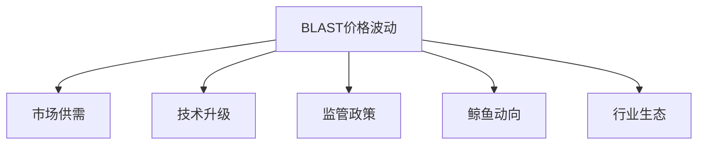

# Blast (BLAST)价格预测与市场展望（2025-2029年）

## 当前市场概况
当前BLAST币价为$0.00201，24小时交易额达$1.56M，流通市值$82.58M，流通量41.05亿枚。近24小时涨幅1.79%，但年初至今跌幅仍达-90.44%。本文将通过多维度分析揭示未来五年市场趋势。

---

## 技术指标深度解析

### 核心分析框架
加密货币交易者通常采用三大技术指标组合研判趋势：
| 指标类型       | 分析维度           | 当前状态     |
|----------------|--------------------|--------------|
| RSI            | 超买超卖信号       | 0.00（超卖） |
| 移动平均线     | 长期趋势判断       | 中性         |
| MACD           | 动量变化监测       | 看跌         |

#### RSI解读
当前RSI指标显示市场处于极端超卖状态。当指标回升至50线时，该位置将形成关键阻力位，突破则可能开启反弹行情。建议关注0.00188-0.00201美元区间支撑强度。

#### 移动平均线
周线级别显示50日均线与200日均线形成死叉，但价格仍维持在均线上方运行。这种背离现象暗示市场可能进入筑底阶段，需持续观察成交量变化确认趋势反转。

#### MACD信号
MACD柱状图连续50周期为负值，快线下穿信号线形成看跌形态。建议投资者重点关注周线级别MACD线能否重返零轴上方，该位置将成为趋势反转的重要信号。

👉 [获取实时市场动态](https://bit.ly/okx_welcome)

---

## 基本面价值评估

### 供需关系模型
BLAST市值$82.58M，流通量占比98.3%（总供应量41.76B）。需特别关注以下指标变化：
- 持仓地址增长速率
- 链上交易笔数变化
- 机构持仓比例
- 重大协议升级计划

### 价格驱动要素

---

## 2025-2029年趋势预测

### 阶段性目标位
| 年份   | 乐观目标 | 中性预期 | 保守预测 |
|--------|----------|----------|----------|
| 2025   | $0.0035  | $0.0028  | $0.0020  |
| 2026   | $0.0060  | $0.0045  | $0.0030  |
| 2027   | $0.0120  | $0.0080  | $0.0040  |
| 2028   | $0.0250  | $0.0150  | $0.0060  |
| 2029   | $0.0500  | $0.0300  | $0.0100  |

预测基于：
1. 行业周期律分析
2. 链上增长数据
3. 市场情绪模型
4. 宏观经济指标

---

## 投资者问答

### Q1：当前BLAST价格走势如何？
当前处于熊市末期筑底阶段，需关注$0.00188关键支撑位。RSI超卖状态为潜在反弹创造技术条件，但需成交量配合突破下降通道上轨。

### Q2：哪些因素会影响BLAST价格？
核心变量包括：
- Layer2赛道整体表现
- 重大合作伙伴进展
- 鲸鱼账户持仓变化
- 监管政策走向
- DeFi市场流动性

### Q3：如何制定投资策略？
建议采用金字塔建仓法：
1. 首批建仓：突破$0.0022阻力位
2. 加仓节点：站稳$0.0025上方
3. 止损设置：跌破$0.00175
4. 目标达成：分阶段止盈

👉 [掌握精准交易策略](https://bit.ly/okx_welcome)

---

## 风险提示
加密货币市场具有高度波动性，本文分析仅供参考。投资者应重点关注：
- 仓位控制（建议单品种不超过总仓位10%）
- 对冲工具运用
- 行业信息跟踪
- 技术形态验证

---

## 未来展望
BLAST作为创新性Layer2协议，其价值取决于生态扩展速度。建议投资者重点关注TVL增长数据、合作伙伴数量、Gas费消耗等核心指标变化。中长期来看，若能突破$0.0030关键阻力，有望开启主升浪行情。

👉 [实时追踪潜力币种](https://bit.ly/okx_welcome)