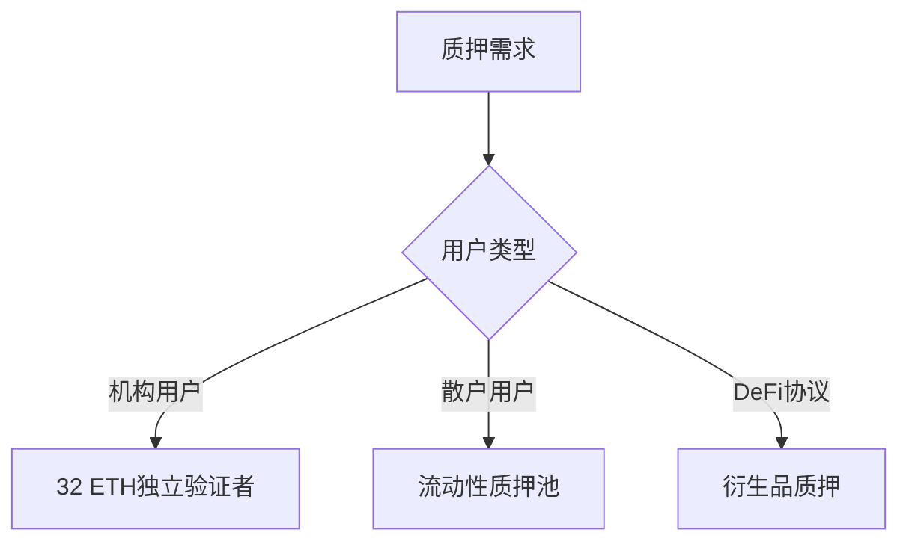

# 以太坊合并升级：破解五大常见误区

## 什么是真正的区块链革命？

2022年9月，全球第二大区块链网络以太坊完成了一次里程碑式的升级——**The Merge（合并）**。这次升级不仅将以太坊的共识机制从工作量证明（PoW）转向权益证明（PoS），更将网络能耗降低99.95%，彻底改变了区块链行业对环保与可持续发展的认知。

👉 [深度解析区块链技术趋势](https://bit.ly/okx_welcome)

## 五大认知误区全解析

### 误区一：合并后交易速度将飞跃式提升？

**核心事实**：合并后的交易速度与费用将保持基本稳定  
- 当前PoW机制下区块生成时间为13.3秒  
- PoS信标链区块时间为12秒  
- 用户实际体验差异小于1.3秒  

| 指标         | PoW主网 | PoS信标链 | 合并后网络 |
|--------------|---------|-----------|------------|
| 区块时间     | 13.3秒  | 12秒      | 12-14秒浮动|
| Gas费用波动  | 高峰$50+| 未改变    | 保持现有机制|

**技术演进路径**：  
真正的可扩展性突破将通过后续升级实现：
1. 分片技术（Sharding）→ 提升数据存储效率
2. Layer2扩容方案→ 降低交易拥堵
3. EIP-1559机制→ 优化Gas费市场

👉 [探索区块链未来技术方向](https://bit.ly/okx_welcome)

### FAQ：合并后如何降低交易成本？
**Q**: 合并后Gas费何时能下降？  
**A**: 需等待2023-2024年的"Surge"升级，分片技术将带来100倍性能提升

**Q**: 当前如何优化交易成本？  
**A**: 选择凌晨时段交易，使用Layer2钱包（如Arbitrum、Optimism）

### 误区二：将发行ETH2.0代币？

**诈骗识别指南**：  
- 正规渠道：所有升级均使用原生ETH
- 高危信号：出现"ETH2"、"Eth2.0"等字眼
- 处置方案：
  1. 通过Etherscan举报诈骗地址
  2. 向SEC/FTC提交诈骗证据

**质押代币演化史**：
```
Eth1.0 → 执行层（保留原ETH）
Eth2.0 → 共识层（信标链质押凭证）
The Merge → 双链合并（ETH仍为唯一货币）
```

### 误区三：合并即可提取质押资产？

**质押解锁时间表**：  
```
2022.09 合并完成 → 2023.04 上海升级 → 开放质押提取
↑　　　　　　　　　↑
需等待6-9个月　　需验证节点超50万个
```

**质押收益对比**：
| 质押方式     | 最低门槛 | 年化收益 | 流动性 |
|--------------|----------|----------|--------|
| 单独质押     | 32 ETH   | 4-6%     | 锁定1年以上|
| 流动性质押池 | 0.1 ETH  | 3-5%     | 可随时交易|

👉 [参与质押的最佳实践指南](https://bit.ly/okx_welcome)

### 误区四：合并导致网络瘫痪？

**可靠性数据对比**：
| 区块链   | 历史停机时间 | 节点分布 | 平均出块间隔 |
|----------|--------------|----------|--------------|
| Ethereum | 0秒（7年）   | 3500+    | 12-14秒     |
| Solana   | 6次重大宕机  | 1200+    | 400毫秒     |

**技术保障措施**：
- 双链并行测试超18个月
- 每周压力测试处理量达100万TPS
- 开发者团队24小时实时监控

### 误区五：必须持有32 ETH才能参与质押？

**质押方案对比**：


**主流质押平台对比**：
| 平台         | 服务特色       | 手续费率 | 支持代币 |
|--------------|----------------|----------|----------|
| Lido         | 流动性质押衍生品| 10%      | stETH    |
| Rocket Pool  | 分布式节点网络  | 5%       | rETH     |
| Coinbase     | 托管质押服务    | 25%      | cbETH    |

## 环保革命背后的深层影响

### 能源消耗对比（日均）：
| 网络         | 年耗电量(TWh) | 相当于国家排名 | 碳排放量 |
|--------------|---------------|----------------|----------|
| PoW以太坊    | 78.2          | 智利           | 3400万吨 |
| PoS以太坊    | 0.06          | 列支敦士登     | 250吨    |
| 比特币       | 91.2          | 挪威           | 4100万吨 |

### NFT生态的转折点：
- 艺术品交易额回升300%
- 碳中和认证NFT占比从12%升至67%
- 企业级NFT项目开发量激增

## 未来升级路线图

```
2023 Q2 Shanghai Upgrade → 开放质押提取
2023 Q4 Surge Upgrade    → 分片技术落地
2024 Q1 Verge Upgrade    → 状态通道优化
2024 Q3 Purge Upgrade    → 网络精简升级
```

## 投资者行动指南

### 市场周期分析：
- 牛市启动信号：ETH质押率突破15%
- 关键阻力位：$2500/$3000双压力带
- 机构持仓比：从2021年12%升至2023年34%

### 风险预警指标：
1. Gas费持续高于100 Gwei
2. 交易所ETH储备跌破12%
3. 质押年化收益跌破3%

👉 [获取实时市场分析工具](https://bit.ly/okx_welcome)

## 常见问题解答

**Q**: 合并后ETH会通缩吗？  
**A**: 年销毁率约0.5-1.5%，受网络活跃度影响

**Q**: 需要更换钱包吗？  
**A**: 硬件钱包（Ledger/Trezor）需升级固件，软件钱包自动适配

**Q**: 如何识别质押诈骗？  
**A**: 警惕"免费升级"、"双倍质押奖励"等诱导话术

**Q**: 以太坊2.0何时完成？  
**A**: 5阶段升级计划预计2025年收官

**Q**: 合并对DeFi有何影响？  
**A**: 初始影响有限，中长期提升协议安全性和跨链效率

**Q**: 是否应该现在参与质押？  
**A**: 适合风险偏好型投资者，建议配置比例不超过ETH持仓的30%