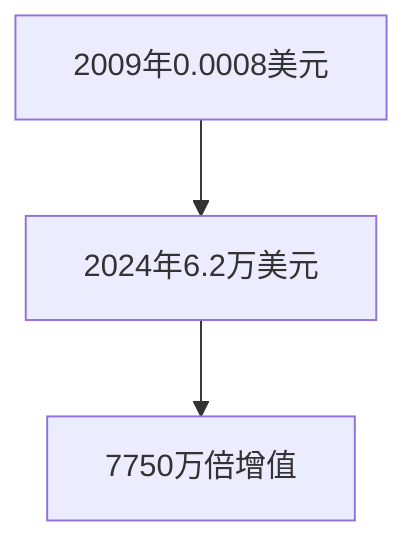
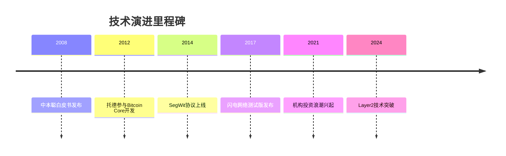

# 比特币创始人中本聪身份之谜：Peter Todd究竟是不是那个神秘人？

## 纪录片掀起身份争议
美国时间10月8日，HBO推出的纪录片《电子货币：比特币之谜》引发全球区块链爱好者关注。该片导演卡伦·霍贝克（Cullen Hoback）通过三年调查，将加拿大密码学家彼得·托德（Peter Todd）锁定为比特币创始人中本聪的疑似人选。这一结论立即在加密货币社区引发激烈争论。

👉 [揭开加密货币投资新机遇](https://bit.ly/okx_welcome)

## 彼得·托德的公开回应
面对纪录片指控，托德在声明中明确表示："我郑重声明绝非中本聪。"这位资深区块链开发者批评该片采用"阴谋论思维"，指出其制作过程存在严重缺陷：
- 未在拍摄前与当事人沟通
- 将巧合进行误导性解读
- 错误解读技术讨论内容

托德强调自己是"加密计时师"身份，其开发的OpenTimestamps项目为区块链时间戳建立了行业标准。作为早期Bitcoin Core贡献者，他始终活跃在加密技术前沿领域。

### 技术专家的质疑
区块链社区发现该纪录片存在多处硬伤：
1. 时间线错位：片中关键证据出现时托德年仅14岁
2. 钱包异常：若托德真是中本聪，其价值680亿美元的110万比特币不可能长期未动
3. 身份矛盾：托德公开技术观点与中本聪早期理念存在明显差异

## 中本聪之谜的前世今生
2008年金融危机背景下，署名中本聪的论文《比特币：一种点对点的电子现金系统》横空出世。这位神秘人物在2011年突然消失，留下价值百亿的加密资产。其身份猜测形成以下四大方向：

| 候选人          | 主要关联点                          | 市场猜测热度 |
|-----------------|-----------------------------------|-------------|
| Len Sassaman    | 已故密码学家，早期比特币讨论参与者    | ★★★★☆       |
| Hal Finney      | 首位比特币接收者，PGP加密专家        | ★★★★☆       |
| Adam Back       | 区块链技术先驱，Hashcash发明者        | ★★★★☆       |
| Nick Szabo      | 智能合约概念提出者，"比特黄金"设计者   | ★★★★★       |

## 区块链技术发展的深层影响
纪录片争议背后，折射出市场对加密货币技术溯源的持续关注。中本聪创世区块中的110万比特币，其价值已从2009年的近乎零元飙升至当前680亿美元。这种价值跃迁凸显了区块链技术的革命性意义：

### 托德的技术贡献解析
作为区块链领域资深开发者，托德的贡献主要体现在：
- **隐私保护**：开发Dark Wallet等匿名交易工具
- **协议改进**：推动多项比特币核心协议升级
- **标准制定**：创建OpenTimestamps时间戳标准

这些工作虽与中本聪的技术构想有交集，但关键设计思路上存在本质差异。

## 常见问题解答
**Q：为何中本聪身份如此重要？**  
A：创始人身份可能影响技术路线选择，且涉及巨额比特币的归属问题，对市场信心具有重大影响。

**Q：纪录片主要证据是否可靠？**  
A：核心证据存在时间线错误、技术误解等问题，多数专家认为难以成立。区块链技术具有可追溯性，身份认定需严谨的技术佐证。

**Q：中本聪消失有何影响？**  
A：保持了比特币的去中心化特性，避免个人意志过度影响技术发展。神秘身份反而强化了系统可信度。

👉 [探索区块链技术应用新场景](https://bit.ly/okx_welcome)

## 比特币生态的持续演进
无论中本聪真实身份如何，比特币已发展出完整的生态系统。从2012年托德参与代码贡献开始，比特币网络持续完善：
- 2014年：引入SegWit协议提升交易容量
- 2017年：闪电网络实现微支付革命
- 2021年：机构投资者大规模入场
- 2024年：Layer2解决方案推动全球化应用

### 加密货币技术发展时间轴

## 未来展望
纪录片争议折射出公众对加密货币技术本源的关注。随着区块链技术的持续发展：
- 零知识证明(ZK-SNARKs)提升隐私保护
- 跨链技术实现价值互联
- 监管科技(RegTech)完善合规框架

👉 [把握区块链技术发展新机遇](https://bit.ly/okx_welcome)

这场持续16的身份谜题，或许正是比特币最成功的去中心化实践。当技术本身超越个人光环，加密货币的真正价值才得以显现。正如中本聪在创世区块中写下的那句《泰晤士报》头条："财政大臣正处于第二次救助银行的边缘"，这句话至今仍在启示我们：区块链技术的本质，是对传统金融体系的创新性重构。